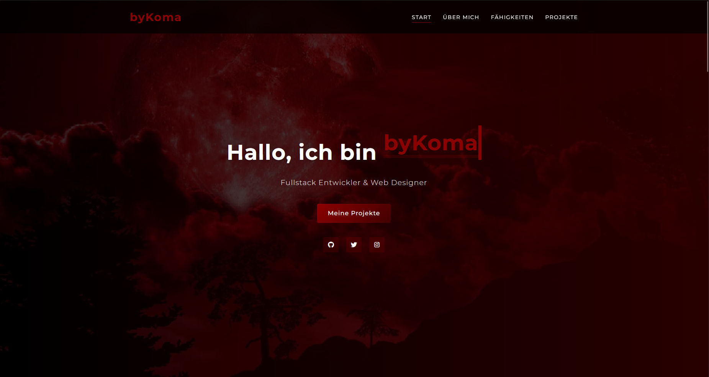
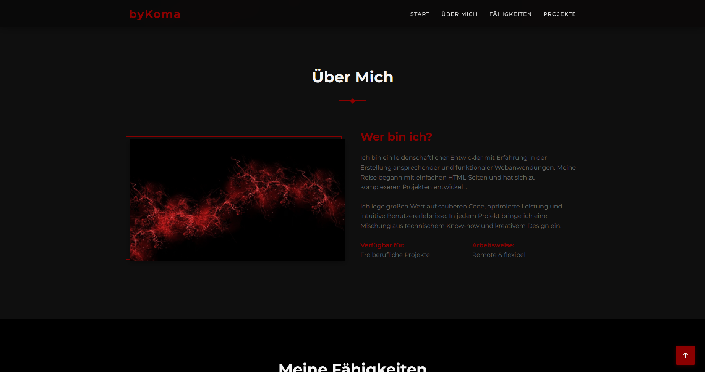
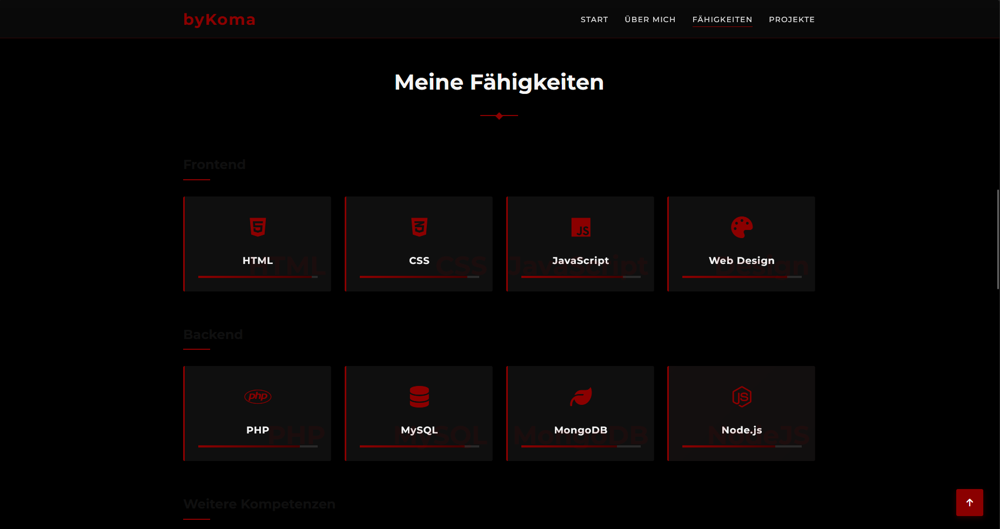
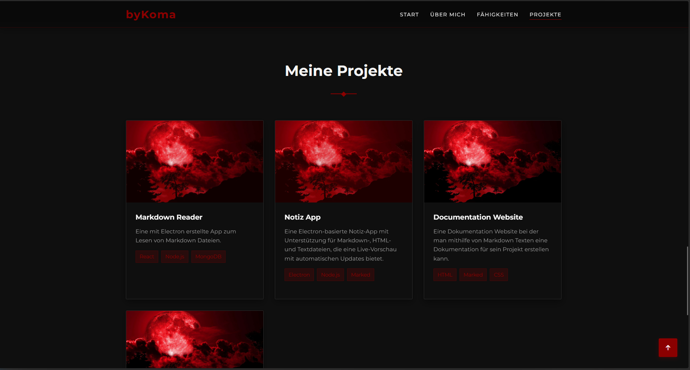

# Developer Portfolio Website

A modern, responsive and animated portfolio website for developers, created with HTML, CSS and JavaScript.

## 📸 Example Images of the Site

Below are example images that show this Template in action (you can remove them by deleting the `img/deleteme/` folder):

  
  
  
  

## Functions

- Fully responsive design that looks good on all devices
- Modern animations and transitions
- Dark hero banner with typing animation
- Project filtering by category
- Skill progress bar with animation
- Contact form with validation
- Back to top button
- Mobile-friendly navigation
- Preloader animation

## Structure

- `index.html` - The main page of the website
- `css/style.css` - All styles for the website
- `js/main.js` - JavaScript for animations and interactions
- `img/` - Folder for all images

## Image requirements

The following images are required for the website to function correctly:

- `img/profile.jpg` - A profile picture for the “About Me” section (recommended size: 400x500px)
- `img/hero-bg.jpg` - A background image for the Hero section (recommended size: 1920x1080px)
- `img/project1.jpg` to `img/project4.jpg` - Images for projects (recommended size: 600x400px)

## Customize

To customize the website:

1. Update your personal information in `index.html`  
   > 💡 *If you want this website customized for you and ready to host, you can get a pre-configured version on my Ko-fi:*  
   > 👉 [ko-fi.com/bykoma](https://ko-fi.com/s/58494c0c1e)
2. Replace the placeholder images in the `img/` folder with your own images  
3. Adjust colors in the CSS file if needed by changing the variables in the `:root` section  
4. Add your own projects by editing the project sections in `index.html`

## Author

This Portfolio-Website was made by byKoma.

## License

This project is available under the MIT license.
